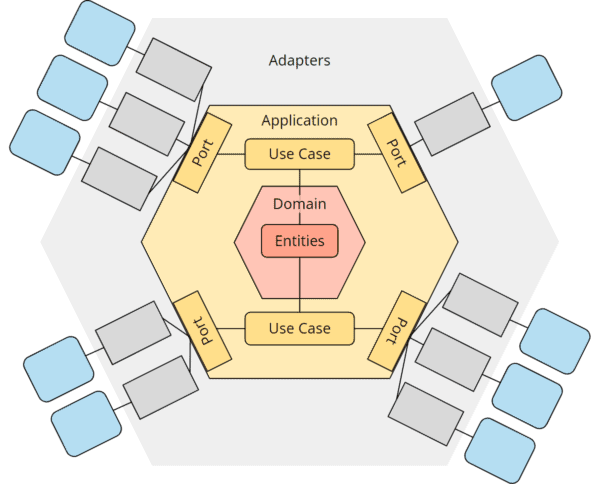

# IP Geolocation API

HTTP API that returns geolocation data (country, city, coordinates) for a given IP address. Lookups are delegated to [ipgeolocation.io](https://ipgeolocation.io/); this service wraps that provider behind a hexagonal Node.js / TypeScript layout so the HTTP surface and the vendor client stay replaceable.

Personal / learning project. Target layout under `src/` is documented below; create those folders as you implement.

## Features

- Lookup geolocation for an IPv4 or IPv6 address
- Thin HTTP API over a third-party geolocation provider
- Application logic depends on ports, not on ipgeolocation.io or a specific web framework

## Quick start

Requirements: Node.js (LTS) and an [ipgeolocation.io](https://ipgeolocation.io/) API key.

```bash
npm install
touch .env   # then set IPGEOLOCATION_API_KEY
npx tsc
node dist/index.js
```

`tsconfig.json` compiles `src/` to `dist/`. Add `dev` / `start` scripts in `package.json` when you settle on a process runner.

## API

```bash
curl -s "http://localhost:3000/geo/8.8.8.8"
```

Example success body:

```json
{
  "ip": "8.8.8.8",
  "country": "United States",
  "city": "Mountain View",
  "latitude": 37.4056,
  "longitude": -122.0775
}
```

Invalid IPs and missing records should return a 4xx JSON error. Provider timeouts, rate limits, and 5xx from ipgeolocation.io should surface as 502/503 without leaking the vendor payload.

## Architecture

Inbound HTTP and the outbound ipgeolocation client are adapters. Use cases talk only to ports. Domain entities sit in the center and do not import adapters.



Domain lives under `application` because the application hexagon owns use cases, ports, and the inner domain model. Adapters stay outside that hexagon.

Target layout:

- Adapters (`src/adapter`) — HTTP (driving) and ipgeolocation client (driven)
- Application (`src/application`)
    - Port (`src/application/port`)
    - Use Case (`src/application/usecase`)
    - Domain (`src/application/domain`)
        - Entities (`src/application/domain/entity`)

## Configuration

| Variable | Required | Example | Purpose |
| --- | --- | --- | --- |
| `IPGEOLOCATION_API_KEY` | yes | `your-api-key` | Authenticates calls to ipgeolocation.io |
| `IPGEOLOCATION_BASE_URL` | yes | `https://api.ipgeolocation.io/v3/ipgeo` | ipgeolocation.io IP geolocation API base URL |
| `PORT` | no | `3000` | HTTP listen port |

Do not commit secrets. Keep keys in `.env` (ignored by git).

Provider: [ipgeolocation.io](https://ipgeolocation.io/) ([API docs](https://ipgeolocation.io/documentation.html)). This project is expected to call their IP geolocation endpoint; map only the fields this API exposes.

## Tech stack

- Node.js — runtime
- TypeScript — source language (`src/` → `dist/`, `module` `nodenext`)
- Hexagonal architecture — ports, use cases, and adapters as above

## License

[ISC](https://opensource.org/license/isc-license-txt)

## Author

Enzo Agustin López
